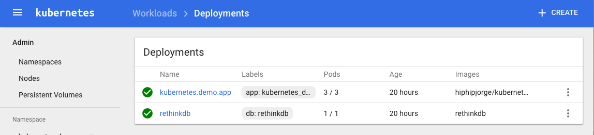
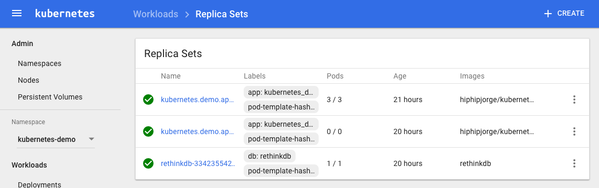
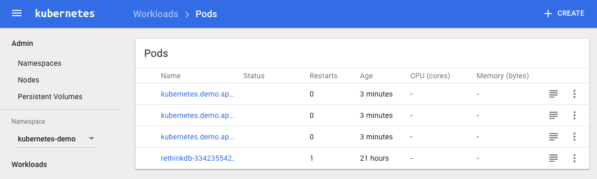
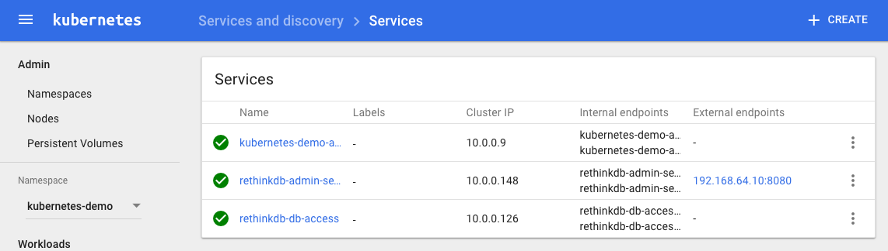
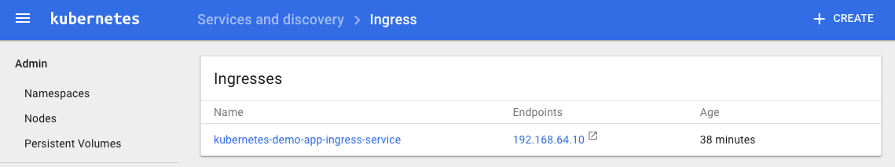

# Kubernetes: How Do I Do That?

### Setup

If you don't have an available Kubernetes cluster, you can create one locally using [minikube](https://kubernetes.io/docs/getting-started-guides/minikube/#installation).

In order to keep the complete demo in the same namespace, first create a namespace in your cluster:

```
kubectl create namespace kubernetes-demo
```

After that, apply all changes to the cluster simultaneously. These can also be applied one by one if needed:

```
kubectl --namespace=kubernetes-demo apply -f app-deployment.yml -f app-service.yml -f app-ingress.yml -f db-deployment.yml -f db-service.yml --record
```

After running this command, you can go to your dashboard. It should look something like this:

##### Deployments



##### Replica Sets



##### Pods



##### Services



##### Ingresses


